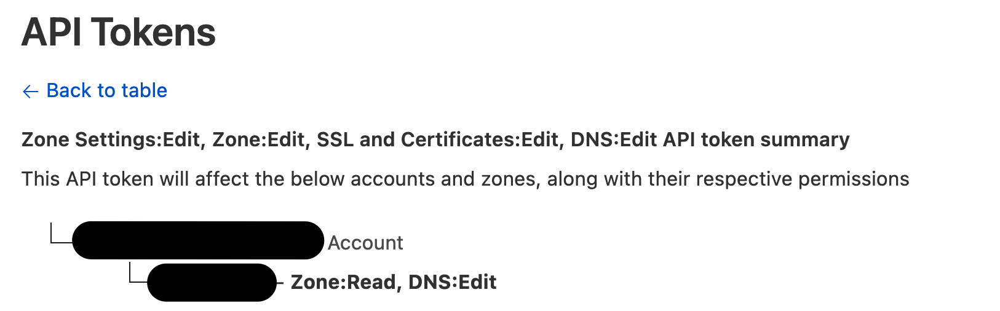

# Berate_radius helper

Help to quickly create a malicious RADIUS server using hostapd-mana

## Get certificate to use:

https://go-acme.github.io/lego/usage/cli/obtain-a-certificate/

https://go-acme.github.io/lego/dns/cloudflare/





example:
```
docker run --rm -it -v certs:/.lego/certificates \
 -e "CF_API_EMAIL=tester@example.com" \
 -e "CF_DNS_API_TOKEN=PLtbXXXXXXXXXXXXXXXVRqda" \
 goacme/lego --email "tester@example.com" --dns cloudflare --domains "wifi.example.com" -a run
```

## Create RADIUS server


## Use RADIUS server


Point Access Point or hostapd to your RADIUS server 

### hostapd

```
eap_server=0
auth_server_addr=127.0.0.1
auth_server_port=1812
auth_server_shared_secret=P@ssw0rd
```

-p 1813:1813/udp -p 1812:1812/udp


